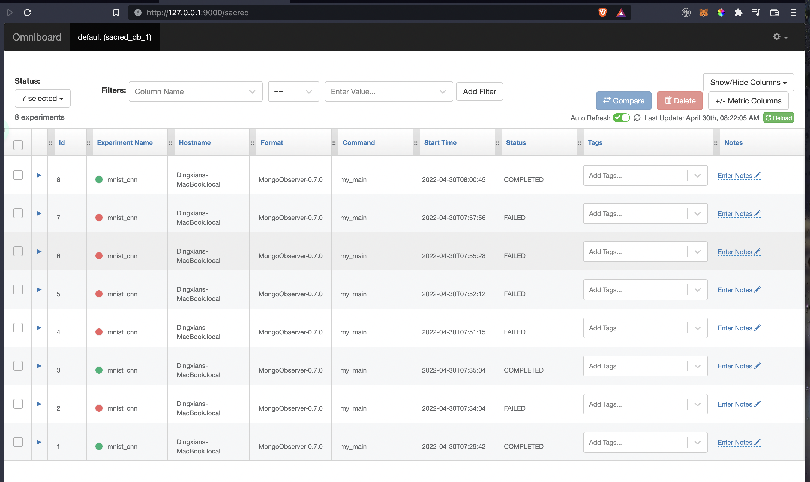

# monitor the experiment

```bash
omniboard -m hostname:port:db_name
```
check the sacred code in the python file:

```python
ex.observers.append(MongoObserver.create(
    url='127.0.0.1:27017',
    db_name='sacred_db_1')
)
```

```bash
$ omniboard -m localhost:27017:sacred_db_1
(node:95468) [MONGODB DRIVER] Warning: Current Server Discovery and Monitoring engine is deprecated, and will be removed in a future version. To use the new Server Discover and Monitoring engine, pass option { useUnifiedTopology: true } to the MongoClient constructor.
(Use `node --trace-warnings ...` to show where the warning was created)
Omniboard is listening on port 9000!
Connection to sacred at mongodb://localhost:27017 established successfully!
```
Open at `http://127.0.0.1:9000/sacred`


